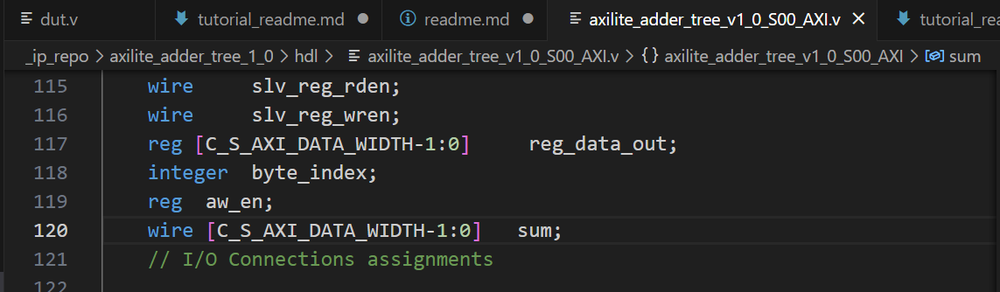

# Lab2 在PYNQ中测试一个8输入32位加法器树IP

## 目标

本实验在原教程的简单加法器IP基础上进行修改，将输入从2输入扩展为8输入，采用三级加法器树完成8个数的加法。使用Vivado创建一个AXI-Lite Slave接口模板文件，然后修改模板文件以封装自己的8输入32位加法器树IP的RTL设计，最后通过PYNQ来调用该IP进行加法功能的测试。本教程将介绍：

- 使用Vivado的“Create and Package New IP”创建AXI-Lite Slave接口模板文件、对其进行修改以封装自己的RTL设计
- 将AXI-Lite Slave的IP集成到硬件系统中
- 在PYNQ中对AXI-Lite Slave接口的IP进行读写

## 环境要求

- PYNQ-Z2远程实验室服务或物理板卡
- Vivado

## 实验步骤

### 1. 创建一个新的AXI IP

1. 打开**Vivado**软件，打开任意一个项目，然后点击左上角工具栏中的**tools**，选择**Create and Package New IP**以开始创建新的IP核。

   

2. 在新弹出的**Create and Package New IP**窗口中选择**Next**以继续

3. 选择**Create a new AXI4 peripheral**的选项，并单击**Next**

   

4. 在**Name**栏输入IP名称**axilite_adder_tree**，在**IP location**栏选择自己的工作目录，然后点击**Next**


5. 进入到**Add Interfaces**界面，进行AXI接口的选择与添加。按照如下界面，添加一个**AXI Lite**的**Slave**接口，**Data Width**设置为**32**，**Number of Registers**设置为**8**，然后点击**Next**继续。

	

6. 选择**Edit IP**，点击**Finish**，这将打开一个新的Vivado开发界面。


### 2. 修改接口模板文件

#### 2.1 查看模板文件

1. 在新弹出的**edit_axilite_adder_tree_v1_0**界面中，双击打开**axilite_adder_tree_v1_0_S00_AXI_inst**文件。在**Design Source**中的外层文件**axilite_adder_tree_v1_0.v**是顶层封装，会根据上一步中添加的AXI接口类型实例化对应AXI Interface; **axilite_adder_tree_v1_0_S00_AXI_inst.v**则包含具体的AXI协议握手内容，也是我们需要修改与关注的部分。


#### 2.2 加入Adder设计

1. 点击左上角**Sources**栏中的加号键，选择**Add or create design sources**并选择**Next**，在弹出界面中添加需要测试的文件**dut.v**并选择**Finish**。


2. 添加的**dut.v**就是我们要测试的IP：

   ```verilog
    module dut(
        input wire [31:0] input1, 
        input wire [31:0] input2, 
        input wire [31:0] input3, 
        input wire [31:0] input4, 
        input wire [31:0] input5, 
        input wire [31:0] input6, 
        input wire [31:0] input7, 
        input wire [31:0] input8, 
        output wire [31:0] sum
    );
    wire [31:0]sum_lv1[3:0];
    wire [31:0]sum_lv2[1:0];

    assign sum_lv1[0] = input1 + input2;
    assign sum_lv1[1] = input3 + input4;
    assign sum_lv1[2] = input5 + input6;
    assign sum_lv1[3] = input7 + input8;
    assign sum_lv2[0] = sum_lv1[0] + sum_lv1[1];
    assign sum_lv2[1] = sum_lv1[2] + sum_lv1[3];
    assign sum = sum_lv2[1] + sum_lv2[0];

    endmodule

   ```

1. 在**axilite_adder_tree_v1_0_S00_AXI_inst.v**第120行左右添加sum信号用于连接dut的输出结果：

   

2. 在**axilite_adder_tree_v1_0_S00_AXI_inst.v**第420行左右修改赋值语句为`3'h7   : reg_data_out <= sum`;用于将dut模块的输出结果赋值给**S_AXI_RDATA**：

   

3. 在**axilite_adder_tree_v1_0_S00_AXI_inst.v**第402行左右添加dut模块的实例化语句，输入为slv_reg到slv_reg7，输出为sum：

   

4. 点击最左侧列导航栏的**Edit Packaged IP**选项，弹出**Package IP**窗口：


5. 在**Package IP**窗口中点击**File Groups**，再点击蓝色的**Merge changes from File Groups Wizard**选项


6. 在**Package IP**窗口中点击**Review and Package**，再点击蓝色的**IP has been modified**选项，之后点击最下方的**Re-Package IP**选项。


7. 提示完成**Package**操作，可以选择**No**先不关闭该窗口。


### 3. 在Vivado中进行IP集成

> 该部分内容与[该教程](https://github.com/ChunxuGuo/SummerSchool2022/blob/main/Lab1_FIR/Lab1%20%E8%AE%BE%E8%AE%A1%E4%B8%80%E4%B8%AAFIR%E6%BB%A4%E6%B3%A2%E5%99%A8%E5%88%86%E7%A6%BB%E9%B8%9F%E7%B1%BB%E5%A3%B0%E9%9F%B3.pdf)第二部分“在Vivado中进行IP集成”完全一致，在此我们略去重复图片，读者如有疑问或对该部分GUI不熟悉，可参考原教程对应部分、有详细的逐步图片展示。

#### 3.1 创建一个新Vivado项目

1. 打开**Vivado**软件，点击**Create Project**，创建一个新的项目，点击**Next**

2. 在**Project name**输入项目名**axilite_adder_tree_system**，点击右侧的 **...** 按键选择一个合适的目录位置，点击**Next** 

3. 进入**Project Type**界面，勾选上**Do not specify sources at this time**，再点击**Next**

4. 进入**Default Part**界面，在**Search**栏中搜索**xc7z020clg484-1**，将其选中，再点击**Next**

5. 点击**Finish**完成项目创建
6. 
   

#### 3.2 导入IP

1. 我们需要首先将刚封装完的AXI-Lite IP导入到**Vivado**中，点击左侧窗口**Flow Navigator**中的**Settings** 选项，弹出**Settings**窗口

2. 将左侧的**Project Settings**中展开**IP**栏目，选中**Repository**项，点击右侧面板中的 **+** 按键，在弹出窗口中选择我们刚才封装的IP **axilite_adder_tree**，再点击**Select**

   

3. 可以看到对应的IP已经被成功添加到了工程中，在两个窗口中依次单击**OK**来关闭这些窗口

#### 3.3 创建Block Design

1. 下面我们创建一个**Block Design**，利用**Vivado**的IP集成功能来构建完整系统。在左侧的**Flow Navigator**中点击**IP INTEGRATOR > Create Block Design**，在弹出的**Create Block Design** 窗口中保持各选项不变，设计名称使用默认的**design_1**，点击**OK**创建**Block Design**

2. 在出现的**Diagram**窗口中点击上方的 **+** 按钮，会弹出一个搜索框，在输入栏中键入**zynq**，双击备选项中出现的**ZYNQ7 Processing System**，即可将该IP添加到设计中

3. 在窗口上方会出现蓝色下划线提示**Run Block Automation**, 单击该区域弹出对应窗口，我们保持默认设置不变，直接点击**OK**

4. 点击Diagam窗口上方的 **+** 按钮，搜索**axilite_adder_tree**，可以看到我们刚才导入的IP已经可以使用了，双击**axilite_adder_tree**以将其添加到设计中

5. 下面我们对设计进行自动连线。点击窗口上方的蓝色下划线提示**Run Connection Automation**，弹出对应窗口，将左侧**All Automation** 选项勾选上，再点击**OK**

6. 系统将根据对应接口自动进行连线，我们可以得到如下图的设计

   

7. 在**Diagram**上侧的工具栏中点击勾形图标**Validate Design**，对设计进行验证

8. 在左侧的**Source > Design Sources > design_1**选项上右键，选择**Generate Output Products**

9. 在弹出窗口中保持各配置不变，点击**Generate**，这一过程将耗费约1分钟的时间

10. 在左侧的**Source > Design Sources > design_1**选项上右键，选择**Create HDL Wrapper**，在弹出窗口中保持选项不变并点击**OK**，完成后可以看到在**design_1.bd**上层嵌套了一层**design_1_wrapper.v**文件

#### 3.4 综合与生成比特流

1. 在左侧的**Flow Navigator**中选择**Run Synthesis**，在弹出窗口中保持选择不变并选择**OK**
   
2. 综合完成后，会弹出**Synthesis Completed**窗口，在**Next**栏中保持默认的**Run Implementation**选项，并点击**OK**，如果出现新弹窗，同样保持默认选项并点击**OK**即可
   
3. **Implementation**结束后，会弹出**Implementation Completed**窗口，在**Next**栏中选择**Generate Bitstream**选项，并点击**OK**，如果出现新弹窗，同样保持默认选项并点击**OK**即可
   
4. 比特流生成后，会弹出**Bitstream Genreation Completed**窗口，我们直接点击**Cancel**即可
   
5. 至此，我们已经完成了硬件部分的设计与导出 

#### 3.5 地址分配

1. 在连接完上述设计后，我们可以点开**Diagram**窗口旁边的**Address Editor**窗口来查看Vivado为我们的IP分配的地址，可以看到Offset为0x43C0_0000，如果我们后续在PYNQ中使用**MMIO**进行寄存器读写的话就会需要知道这些值。


### 4. PYNQ框架中进行测试

#### 4.1 提取bit与hwh文件

1. 在文件管理器中访问 **\axilite_adder_tree_system\axilite_adder_tree_system.gen\sources_1\bd\design_1\hw_handoff** 目录，其中的**design_1.hwh**即为我们需要的**hardware handoff**文件，将其复制到自己的文件夹中保存，并重命名为**adder_tree.hwh**

#### 4.2 访问Jupyter（因2024/7/18/23:10远程实验室无法正常登录，以下操作还未进行）
   
1. 请先完成PYNQ远程实验室的账号注册与**Jupyter**访问
2. 登录**Jupyter**界面，点击界面右上方的**upload**按钮，将以下文件上传到开发板上
   
   - **/jupyter** 目录下的**adder.ipynb**
   - 上一步中得到的**adder.bit**与**adder.hwh**文件
     
     - 如果你在前面操作中导出失败了，你也可以先使用 **/overlay** 目录下的**adder.bit**与**adder.hwh**文件上传，以完成余下实验
   


#### 4.3 部署与运行Overlay

1. 在**Jupyter**中进入到**adder.ipynb**页面，**Kernel**自动加载完成显示为**Python3**字样

2. 点击窗口上侧的**Run**按钮，**Jupyter Notebook**会执行当前**Cell**，同时自动切换到下一个**Cell**
   
3. 完成按照顺序依次点击**Run**至结束即可，各代码块的含义在**Jupyter Notebook**中已经标注，请阅读**Jupyter Notebook**中的信息继续完成实验。

